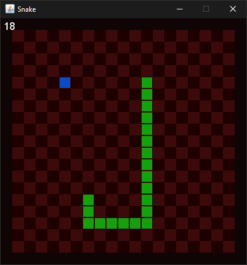

# Snake

A simple snake game that I made for fun.

#### Running

\* You must have JRE 1.8 or newer to run. Second option will only work if you have your java path set.

Either:
* Double click the snake.jar file

or
* cd to where the file is located and run:
`java -jar snake.jar`

#### How to play

Pretty self-explanatory but: 
* WASD/Arrow Keys to move
* Eating apples makes snake longer and increases score *(plays a sound)*
* Hitting walls or the snake tail restarts the game *(also plays a sound)*

